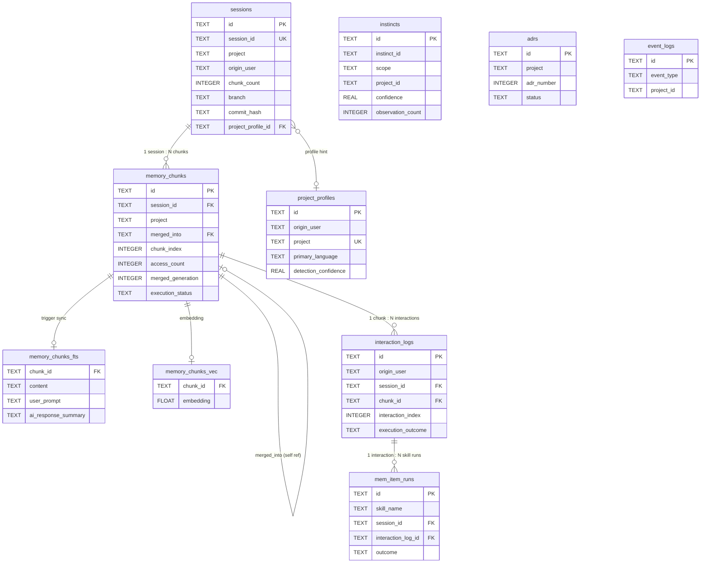
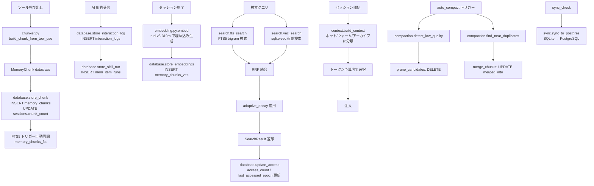

# mem.db スキーマリファレンス

`~/.devgear/mem.db` は devgear のメモリサブシステムが使用する SQLite データベースです。
セッション記録・意味検索・学習インスティンクト・ADR・イベントログを一元管理します。
PostgreSQL 同期対象のテーブルには `synced_at` 列があり、`NULL` は未同期、`NULL` 以外は同期済みを表します。

---

## 目次

1. [テーブル一覧](#テーブル一覧)
2. [テーブル詳細](#テーブル詳細)
   - [memory_chunks](#memory_chunks)
   - [sessions](#sessions)
   - [memory_chunks_fts](#memory_chunks_fts)
   - [memory_chunks_vec](#memory_chunks_vec)
   - [instincts](#instincts)
   - [adrs](#adrs)
   - [event_logs](#event_logs)
   - [interaction_logs](#interaction_logs)
   - [project_profiles](#project_profiles)
   - [mem_item_runs](#mem_item_runs)
   - [schema_migrations](#schema_migrations)
3. [テーブル間の関係](#テーブル間の関係)
4. [JSON フィールドの形式](#json-フィールドの形式)
5. [タイムスタンプと時間減衰](#タイムスタンプと時間減衰)
6. [データフロー](#データフロー)
7. [PRAGMA 設定](#pragma-設定)
8. [PostgreSQL 同期時の拡張](#postgresql-同期時の拡張)

---

## テーブル一覧

| テーブル名 | 種別 | 役割 |
|-----------|------|------|
| `memory_chunks` | 通常テーブル | セッション内のツール操作・会話内容を時系列で記録するコアテーブル |
| `sessions` | 通常テーブル | セッションのメタデータ（開始時刻・プロジェクト名など） |
| `memory_chunks_fts` | VIRTUAL TABLE (FTS5) | `memory_chunks` の trigram 全文検索インデックス |
| `memory_chunks_vec` | VIRTUAL TABLE (sqlite-vec) | `memory_chunks` の 768 次元ベクトル検索インデックス |
| `instincts` | 通常テーブル | s-learn が抽出した再利用可能な学習パターン |
| `adrs` | 通常テーブル | s-adr が記録するアーキテクチャ決定記録 |
| `event_logs` | 通常テーブル | システムイベントの監査ログ（圧縮・同期完了など） |
| `interaction_logs` | 通常テーブル | ユーザー指示と AI 応答のペア記録（スキル自動生成の原料） |
| `project_profiles` | 通常テーブル | プロジェクトの技術スタック情報（instinct の scope 判定に使用） |
| `mem_item_runs` | 通常テーブル | スキル活用記録（ベストエフォート観測） |
| `schema_migrations` | 通常テーブル | マイグレーション適用履歴（重複適用防止） |

---

## テーブル詳細

### memory_chunks

セッション内のツール操作・会話内容を保存するコアテーブル。
1 チャンク = 1 回のツール呼び出しまたは会話交換に相当します。

```sql
CREATE TABLE IF NOT EXISTS memory_chunks (
  id                  TEXT    PRIMARY KEY,
  origin_user         TEXT    NOT NULL DEFAULT '',
  session_id          TEXT    NOT NULL,
  project             TEXT    NOT NULL,
  chunk_index         INTEGER NOT NULL,
  content             TEXT    NOT NULL,
  tool_names          TEXT,
  files_read          TEXT,
  files_modified      TEXT,
  user_prompt         TEXT,
  created_at          TEXT    DEFAULT (datetime('now')),
  created_at_epoch    INTEGER NOT NULL,
  access_count        INTEGER DEFAULT 0,
  last_accessed_epoch INTEGER,
  merged_generation   INTEGER DEFAULT 0,
  merged_into         TEXT    REFERENCES memory_chunks(id),
  execution_status    TEXT    DEFAULT 'unknown',
  tool_error          TEXT,
  ai_response_summary TEXT,
  tool_sequence       TEXT    DEFAULT '[]',
  synced_at           TEXT,
  UNIQUE(session_id, chunk_index)
);

CREATE INDEX IF NOT EXISTS idx_chunks_session ON memory_chunks(session_id);
CREATE INDEX IF NOT EXISTS idx_chunks_project ON memory_chunks(project);
CREATE INDEX IF NOT EXISTS idx_chunks_epoch   ON memory_chunks(created_at_epoch);
CREATE INDEX IF NOT EXISTS idx_chunks_origin  ON memory_chunks(origin_user);
```

#### カラム

| カラム名 | 型 | 制約 | 説明 |
|---------|-----|------|------|
| `id` | TEXT | PRIMARY KEY | UUID v4。チャンクの一意識別子 |
| `origin_user` | TEXT | NOT NULL DEFAULT '' | チャンクを生成したユーザー名（マルチユーザー環境での判別用） |
| `session_id` | TEXT | NOT NULL | 属するセッション ID。`sessions.session_id` と対応 |
| `project` | TEXT | NOT NULL | プロジェクト名。プロジェクト別検索・コンテキスト注入に使用 |
| `chunk_index` | INTEGER | NOT NULL | セッション内の通し番号（0始まり）。`session_id` と合わせてユニーク |
| `content` | TEXT | NOT NULL | チャンク本文（最大 `settings.chunk_max_length` = 2000 文字）。ツール操作の要約や会話内容 |
| `tool_names` | TEXT | - | 使用ツール名の JSON 配列文字列。例: `["Read", "Edit", "Bash"]` |
| `files_read` | TEXT | - | 読み取ったファイルパスの JSON 配列文字列 |
| `files_modified` | TEXT | - | 変更・作成したファイルパスの JSON 配列文字列 |
| `user_prompt` | TEXT | - | ユーザーの入力プロンプト。FTS5 検索・コンテキスト判定に使用 |
| `created_at` | TEXT | DEFAULT (datetime('now')) | 挿入時刻（人間可読形式、デバッグ用） |
| `created_at_epoch` | INTEGER | NOT NULL | 作成時刻（Unix エポック秒）。時間減衰スコア計算の基準 |
| `access_count` | INTEGER | DEFAULT 0 | 検索でヒットした累計回数。重要度スコア（40%）に影響 |
| `last_accessed_epoch` | INTEGER | - | 最終ヒット時刻（Unix エポック秒）。時間減衰の参照時刻として `created_at_epoch` より優先 |
| `merged_generation` | INTEGER | DEFAULT 0 | 圧縮された回数（0 = 未圧縮）。圧縮のたびに +1 |
| `merged_into` | TEXT | REFERENCES memory_chunks(id) | 圧縮・統合先チャンクの ID。値がある場合は統合済みで検索対象外 |
| `execution_status` | TEXT | DEFAULT 'unknown' | ツール実行結果（`'success'` / `'partial'` / `'failure'` / `'unknown'`） |
| `tool_error` | TEXT | - | 直近のツールエラーメッセージ（デバッグ・パターン検出用） |
| `ai_response_summary` | TEXT | - | AI 応答の要約テキスト。FTS5 インデックスにも含まれる |
| `tool_sequence` | TEXT | DEFAULT '[]' | ツール呼び出し順序の JSON 配列。例: `["Read", "Edit", "Bash"]` |

#### 主要な操作

| 操作 | 呼び出し元 | 説明 |
|------|-----------|------|
| INSERT | `database.store_chunk()` | セッション実行中にチャンクを保存。同一 TX で `sessions.chunk_count += 1` |
| UPDATE | `database.update_access()` | 検索ヒット時に `access_count += 1` と `last_accessed_epoch` を更新 |
| UPDATE | `compaction.merge_chunks()` | 圧縮時に `merged_generation` と `merged_into` を更新 |
| SELECT | `database.get_recent_chunks()` | コンテキスト注入用。プロジェクト・件数指定で最新チャンクを取得 |
| SELECT | `database.get_chunks_by_ids()` | 検索後の N+1 回避バッチ取得 |
| DELETE | `compaction.prune_candidates()` | decay < 0.01 かつ access_count = 0 のチャンクを削除 |

---

### sessions

1 セッション = 1 行。`memory_chunks` と 1:N の関係。

```sql
CREATE TABLE IF NOT EXISTS sessions (
  id                 TEXT    PRIMARY KEY,
  origin_user        TEXT    NOT NULL DEFAULT '',
  session_id         TEXT    NOT NULL,
  project            TEXT    NOT NULL,
  started_at         TEXT    DEFAULT (datetime('now')),
  started_at_epoch   INTEGER NOT NULL,
  chunk_count        INTEGER DEFAULT 0,
  branch             TEXT,
  commit_hash        TEXT,
  uncommitted_count  INTEGER DEFAULT 0,
  ended_at_epoch     INTEGER,
  project_profile_id TEXT,
  synced_at          TEXT,
  UNIQUE(session_id)
);

CREATE INDEX IF NOT EXISTS idx_sessions_origin ON sessions(origin_user);
```

#### カラム

| カラム名 | 型 | 制約 | 説明 |
|---------|-----|------|------|
| `id` | TEXT | PRIMARY KEY | UUID v4 |
| `origin_user` | TEXT | NOT NULL DEFAULT '' | セッションを開始したユーザー名 |
| `session_id` | TEXT | NOT NULL UNIQUE | セッション識別子 |
| `project` | TEXT | NOT NULL | セッションが属するプロジェクト名 |
| `started_at` | TEXT | DEFAULT (datetime('now')) | セッション開始時刻（人間可読） |
| `started_at_epoch` | INTEGER | NOT NULL | セッション開始時刻（Unix エポック秒） |
| `chunk_count` | INTEGER | DEFAULT 0 | このセッションに属するチャンク数（`store_chunk()` のたびに +1） |
| `branch` | TEXT | - | セッション開始時の git ブランチ名 |
| `commit_hash` | TEXT | - | セッション開始時の git コミットハッシュ |
| `uncommitted_count` | INTEGER | DEFAULT 0 | セッション開始時の未コミット変更ファイル数 |
| `ended_at_epoch` | INTEGER | - | セッション終了時刻（Unix エポック秒）。セッション中は NULL |
| `project_profile_id` | TEXT | - | `project_profiles.id` への参照 |

---

### memory_chunks_fts

`memory_chunks` の trigram 全文検索インデックス。INSERT/UPDATE/DELETE トリガーで自動同期されるため、直接操作は不要。

```sql
CREATE VIRTUAL TABLE IF NOT EXISTS memory_chunks_fts USING fts5(
  chunk_id    UNINDEXED,
  content,
  user_prompt,
  tool_names,
  files_read,
  files_modified,
  ai_response_summary,
  tokenize='trigram'
);
```

#### カラム

| カラム名 | 説明 |
|---------|------|
| `chunk_id` | `memory_chunks.id` への参照（`UNINDEXED` = FTS5 検索対象外） |
| `content` | チャンク本文（FTS5 検索対象） |
| `user_prompt` | ユーザープロンプト（FTS5 検索対象） |
| `tool_names` | ツール名 JSON 文字列（FTS5 検索対象） |
| `files_read` | 読み取りファイル JSON 文字列（FTS5 検索対象） |
| `files_modified` | 変更ファイル JSON 文字列（FTS5 検索対象） |
| `ai_response_summary` | AI 応答要約（FTS5 検索対象） |

**trigram トークナイザー**を使用するため、2 文字以上の部分文字列にマッチします。`search.fts_search()` でクエリを渡すと `content` と `user_prompt` を対象に検索します。

---

### memory_chunks_vec

`memory_chunks` の 768 次元ベクトル検索インデックス（sqlite-vec 拡張が必要）。
`cl-nagoya/ruri-v3-310m` モデルで生成した埋め込みベクトルを格納します。

```sql
CREATE VIRTUAL TABLE IF NOT EXISTS memory_chunks_vec USING vec0(
  chunk_id  TEXT PRIMARY KEY,
  embedding FLOAT[768]
);
```

#### カラム

| カラム名 | 型 | 説明 |
|---------|-----|------|
| `chunk_id` | TEXT PRIMARY KEY | `memory_chunks.id` への参照 |
| `embedding` | FLOAT[768] | 768 次元の float32 埋め込みベクトル（バイナリ形式で格納） |

**挿入タイミング:** セッション終了時（`session_end` フック）にバッチで生成・挿入されます。sqlite-vec が未インストールの場合はスキップされます。

---

### instincts

s-learn が抽出した再利用可能な行動パターン。`scope` で global / project を区別します。

```sql
CREATE TABLE IF NOT EXISTS instincts (
  id                       TEXT    PRIMARY KEY,
  origin_user              TEXT    NOT NULL DEFAULT '',
  instinct_id              TEXT    NOT NULL,
  scope                    TEXT    NOT NULL,
  project_id               TEXT,
  trigger_text             TEXT,
  confidence               REAL    NOT NULL,
  domain                   TEXT,
  content                  TEXT    NOT NULL,
  created_at_epoch         INTEGER NOT NULL,
  updated_at_epoch         INTEGER NOT NULL,
  observation_count        INTEGER DEFAULT 0,
  confidence_reasons       TEXT    DEFAULT '[]',
  source_interaction_ids   TEXT    DEFAULT '[]',
  last_activated_epoch     INTEGER,
  synced_at                TEXT,
  UNIQUE(origin_user, instinct_id, scope, project_id)
);

CREATE INDEX IF NOT EXISTS idx_instincts_user    ON instincts(origin_user);
CREATE INDEX IF NOT EXISTS idx_instincts_scope   ON instincts(scope);
CREATE INDEX IF NOT EXISTS idx_instincts_project ON instincts(project_id);
```

#### カラム

| カラム名 | 型 | 制約 | 説明 |
|---------|-----|------|------|
| `id` | TEXT | PRIMARY KEY | UUID v4 |
| `origin_user` | TEXT | NOT NULL DEFAULT '', UNIQUE 構成 | インスティンクトを生成したユーザー名 |
| `instinct_id` | TEXT | NOT NULL, UNIQUE 構成 | インスティンクトの意味的 ID（例: `"skill-pattern-001"`） |
| `scope` | TEXT | NOT NULL, UNIQUE 構成 | スコープ種別。`"global"` / `"project"` / `"team"` など |
| `project_id` | TEXT | UNIQUE 構成 | プロジェクト ID（`scope = "project"` のときのみ値あり） |
| `trigger_text` | TEXT | - | このインスティンクトが発動するトリガーパターン |
| `confidence` | REAL | NOT NULL | 信頼度スコア（0.0 〜 1.0）。高いほど確度が高い |
| `domain` | TEXT | - | ドメイン分類（例: `"debugging"` / `"optimization"`） |
| `content` | TEXT | NOT NULL | インスティンクトの本文（行動パターン・スキル説明など） |
| `created_at_epoch` | INTEGER | NOT NULL | 作成時刻（Unix エポック秒） |
| `updated_at_epoch` | INTEGER | NOT NULL | 最終更新時刻（Unix エポック秒）。UPSERT で更新される |
| `observation_count` | INTEGER | DEFAULT 0 | このインスティンクトが観測された累計回数 |
| `confidence_reasons` | TEXT | DEFAULT '[]' | 信頼度の根拠を格納した JSON 配列 |
| `source_interaction_ids` | TEXT | DEFAULT '[]' | 導出元の `interaction_logs.id` リスト（JSON 配列） |
| `last_activated_epoch` | INTEGER | - | 最終発動時刻（Unix エポック秒） |

**UPSERT 動作:** `(origin_user, instinct_id, scope, project_id)` が競合した場合、`trigger_text`・`confidence`・`domain`・`content`・`updated_at_epoch` などを上書き更新します。

---

### adrs

s-adr が記録するアーキテクチャ決定記録（Architecture Decision Record）。

```sql
CREATE TABLE IF NOT EXISTS adrs (
  id               TEXT    PRIMARY KEY,
  origin_user      TEXT    NOT NULL DEFAULT '',
  project          TEXT    NOT NULL,
  adr_number       INTEGER NOT NULL,
  title            TEXT    NOT NULL,
  status           TEXT    NOT NULL,
  content          TEXT    NOT NULL,
  created_at_epoch INTEGER NOT NULL,
  updated_at_epoch INTEGER NOT NULL,
  synced_at        TEXT,
  UNIQUE(origin_user, project, adr_number)
);

CREATE INDEX IF NOT EXISTS idx_adrs_user    ON adrs(origin_user);
CREATE INDEX IF NOT EXISTS idx_adrs_project ON adrs(project);
```

#### カラム

| カラム名 | 型 | 制約 | 説明 |
|---------|-----|------|------|
| `id` | TEXT | PRIMARY KEY | UUID v4 |
| `origin_user` | TEXT | NOT NULL DEFAULT '', UNIQUE 構成 | ADR を作成したユーザー名 |
| `project` | TEXT | NOT NULL, UNIQUE 構成 | 対象プロジェクト名 |
| `adr_number` | INTEGER | NOT NULL, UNIQUE 構成 | プロジェクト内の通し番号（1 始まり） |
| `title` | TEXT | NOT NULL | ADR タイトル |
| `status` | TEXT | NOT NULL | ADR ステータス（`"proposed"` / `"accepted"` / `"deprecated"` など） |
| `content` | TEXT | NOT NULL | ADR 本文（Context / Decision / Consequences などのセクションを含む Markdown） |
| `created_at_epoch` | INTEGER | NOT NULL | 作成時刻（Unix エポック秒） |
| `updated_at_epoch` | INTEGER | NOT NULL | 最終更新時刻（Unix エポック秒） |

---

### event_logs

システムイベントの監査ログ。圧縮実行・PostgreSQL 同期完了・スキル学習などを記録します。

```sql
CREATE TABLE IF NOT EXISTS event_logs (
  id               TEXT    PRIMARY KEY,
  origin_user      TEXT    NOT NULL DEFAULT '',
  event_type       TEXT    NOT NULL,
  project_id       TEXT,
  content          TEXT    NOT NULL,
  created_at_epoch INTEGER NOT NULL,
  synced_at        TEXT
);

CREATE INDEX IF NOT EXISTS idx_events_type    ON event_logs(event_type);
CREATE INDEX IF NOT EXISTS idx_events_epoch   ON event_logs(created_at_epoch);
CREATE INDEX IF NOT EXISTS idx_events_project ON event_logs(project_id);
```

#### カラム

| カラム名 | 型 | 制約 | 説明 |
|---------|-----|------|------|
| `id` | TEXT | PRIMARY KEY | UUID v4 |
| `origin_user` | TEXT | NOT NULL DEFAULT '' | イベントを発生させたユーザー名 |
| `event_type` | TEXT | NOT NULL | イベント種別（例: `"session_start"`, `"compact"`, `"skill_learned"`, `"pg_sync"`） |
| `project_id` | TEXT | - | 関連プロジェクト ID（イベントがプロジェクト非依存の場合は NULL） |
| `content` | TEXT | NOT NULL | イベントの詳細情報（JSON 文字列または自由テキスト） |
| `created_at_epoch` | INTEGER | NOT NULL | イベント発生時刻（Unix エポック秒） |

INSERT には `INSERT OR IGNORE` が使われるため、重複エントリは自動的に無視されます。

---

### interaction_logs

ユーザー指示と AI 応答のペア記録。s-learn によるスキル自動生成の最重要原料。

```sql
CREATE TABLE IF NOT EXISTS interaction_logs (
  id                    TEXT    PRIMARY KEY,
  origin_user           TEXT    NOT NULL DEFAULT '',
  session_id            TEXT    NOT NULL,
  project               TEXT    NOT NULL,
  user_prompt_full      TEXT    NOT NULL,
  user_prompt_hash      TEXT,
  ai_response_summary   TEXT,
  ai_response_tool_plan TEXT,
  chunk_id              TEXT    REFERENCES memory_chunks(id),
  execution_outcome     TEXT    DEFAULT 'unknown',
  tool_error_count      INTEGER DEFAULT 0,
  interaction_index     INTEGER NOT NULL,
  created_at_epoch      INTEGER NOT NULL,
  synced_at             TEXT,
  UNIQUE(session_id, interaction_index)
);

CREATE INDEX IF NOT EXISTS idx_ilog_session ON interaction_logs(session_id);
CREATE INDEX IF NOT EXISTS idx_ilog_project ON interaction_logs(project);
CREATE INDEX IF NOT EXISTS idx_ilog_epoch   ON interaction_logs(created_at_epoch);
CREATE INDEX IF NOT EXISTS idx_ilog_outcome ON interaction_logs(execution_outcome);
CREATE INDEX IF NOT EXISTS idx_ilog_hash    ON interaction_logs(user_prompt_hash);
```

#### カラム

| カラム名 | 型 | 制約 | 説明 |
|---------|-----|------|------|
| `id` | TEXT | PRIMARY KEY | UUID v4 |
| `origin_user` | TEXT | NOT NULL DEFAULT '' | 連携元ユーザー名（マルチユーザー環境での発生源特定用） |
| `session_id` | TEXT | NOT NULL | 属するセッション ID |
| `project` | TEXT | NOT NULL | プロジェクト名 |
| `user_prompt_full` | TEXT | NOT NULL | ユーザー指示の全文（トランケートなし） |
| `user_prompt_hash` | TEXT | - | `user_prompt_full` の SHA256 先頭 16 文字（重複検出用） |
| `ai_response_summary` | TEXT | - | AI 応答の要約（最大 2000 文字） |
| `ai_response_tool_plan` | TEXT | - | AI が計画したツール呼び出しシーケンスの JSON 配列（最大 10 件） |
| `chunk_id` | TEXT | REFERENCES memory_chunks(id) | 対応する `memory_chunks.id` |
| `execution_outcome` | TEXT | DEFAULT 'unknown' | 実行結果（`'success'` / `'partial'` / `'failure'` / `'unknown'`） |
| `tool_error_count` | INTEGER | DEFAULT 0 | 発生したツールエラーの件数 |
| `interaction_index` | INTEGER | NOT NULL | セッション内の通し番号（`session_id` と合わせてユニーク） |
| `created_at_epoch` | INTEGER | NOT NULL | 記録時刻（Unix エポック秒） |

---

### project_profiles

プロジェクトの技術スタック情報。instinct の `scope = "project"` 判定や同期時のメタデータとして使用されます。

```sql
CREATE TABLE IF NOT EXISTS project_profiles (
  id                   TEXT    PRIMARY KEY,
  origin_user          TEXT    NOT NULL DEFAULT '',
  project              TEXT    NOT NULL,
  project_path         TEXT,
  languages            TEXT    NOT NULL DEFAULT '[]',
  frameworks           TEXT    NOT NULL DEFAULT '[]',
  primary_language     TEXT,
  test_command         TEXT,
  build_command        TEXT,
  scope_hint           TEXT    DEFAULT 'project',
  detected_at_epoch    INTEGER NOT NULL,
  last_updated_epoch   INTEGER NOT NULL,
  detection_confidence REAL    DEFAULT 1.0,
  synced_at            TEXT,
  UNIQUE(origin_user, project)
);

CREATE INDEX IF NOT EXISTS idx_proj_prof_user ON project_profiles(origin_user);
CREATE INDEX IF NOT EXISTS idx_proj_prof_lang ON project_profiles(primary_language);
```

#### カラム

| カラム名 | 型 | 制約 | 説明 |
|---------|-----|------|------|
| `id` | TEXT | PRIMARY KEY | UUID v4 |
| `origin_user` | TEXT | NOT NULL DEFAULT '', UNIQUE 構成 | プロファイルを登録したユーザー名 |
| `project` | TEXT | NOT NULL, UNIQUE 構成 | プロジェクト名 |
| `project_path` | TEXT | - | プロジェクトのルートディレクトリ絶対パス |
| `languages` | TEXT | NOT NULL DEFAULT '[]' | 検出された言語の JSON 配列。例: `["python", "javascript"]` |
| `frameworks` | TEXT | NOT NULL DEFAULT '[]' | 検出されたフレームワークの JSON 配列。例: `["pytest", "pydantic"]` |
| `primary_language` | TEXT | - | 主要言語（例: `"python"`）。インデックスあり |
| `test_command` | TEXT | - | テスト実行コマンド（例: `"python3 -m pytest -q"`） |
| `build_command` | TEXT | - | ビルドコマンド |
| `scope_hint` | TEXT | DEFAULT 'project' | instinct スコープ判定のヒント |
| `detected_at_epoch` | INTEGER | NOT NULL | 初回検出時刻（Unix エポック秒） |
| `last_updated_epoch` | INTEGER | NOT NULL | 最終更新時刻（Unix エポック秒） |
| `detection_confidence` | REAL | DEFAULT 1.0 | 技術スタック検出の信頼度（0.0 〜 1.0） |

---

### mem_item_runs

スキル活用記録。`interaction_logs` との紐付けでスキルの効果測定・改善に使用されます。

```sql
CREATE TABLE IF NOT EXISTS mem_item_runs (
  id                   TEXT    PRIMARY KEY,
  origin_user          TEXT    NOT NULL DEFAULT '',
  session_id           TEXT    NOT NULL,
  project              TEXT    NOT NULL,
  skill_name           TEXT    NOT NULL,
  skill_trigger        TEXT,
  outcome              TEXT    DEFAULT 'unknown',
  tools_used           TEXT    DEFAULT '[]',
  files_modified_count INTEGER DEFAULT 0,
  duration_seconds     INTEGER,
  interaction_log_id   TEXT    REFERENCES interaction_logs(id),
  created_at_epoch     INTEGER NOT NULL,
  synced_at            TEXT
);

CREATE INDEX IF NOT EXISTS idx_msr_skill   ON mem_item_runs(skill_name);
CREATE INDEX IF NOT EXISTS idx_msr_project ON mem_item_runs(project);
CREATE INDEX IF NOT EXISTS idx_msr_epoch   ON mem_item_runs(created_at_epoch);
CREATE INDEX IF NOT EXISTS idx_msr_outcome ON mem_item_runs(outcome, created_at_epoch);
```

#### カラム

| カラム名 | 型 | 制約 | 説明 |
|---------|-----|------|------|
| `id` | TEXT | PRIMARY KEY | UUID v4 |
| `origin_user` | TEXT | NOT NULL DEFAULT '' | スキルを実行したユーザー名 |
| `session_id` | TEXT | NOT NULL | 実行時のセッション ID |
| `project` | TEXT | NOT NULL | 実行時のプロジェクト名 |
| `skill_name` | TEXT | NOT NULL | スキル名（例: `"s-tdd"`, `"s-review"`） |
| `skill_trigger` | TEXT | - | スキルが発動したトリガーテキスト（ユーザー入力など） |
| `outcome` | TEXT | DEFAULT 'unknown' | 実行結果（`'success'` / `'partial'` / `'failure'` / `'unknown'`） |
| `tools_used` | TEXT | DEFAULT '[]' | スキル実行中に使用されたツール名の JSON 配列 |
| `files_modified_count` | INTEGER | DEFAULT 0 | スキル実行中に変更されたファイル数 |
| `duration_seconds` | INTEGER | - | スキル実行時間（秒） |
| `interaction_log_id` | TEXT | REFERENCES interaction_logs(id) | 対応する `interaction_logs.id` |
| `created_at_epoch` | INTEGER | NOT NULL | 実行時刻（Unix エポック秒） |

---

### schema_migrations

マイグレーション適用履歴を管理するテーブル。初回起動時に `_SCHEMA_SQL` で作成後、`_MIGRATIONS` リストに沿って順次適用されます。

```sql
CREATE TABLE IF NOT EXISTS schema_migrations (
  version          TEXT    PRIMARY KEY,
  applied_at_epoch INTEGER NOT NULL
);
```

#### カラム

| カラム名 | 型 | 制約 | 説明 |
|---------|-----|------|------|
| `version` | TEXT | PRIMARY KEY | マイグレーション識別子（例: `"001_add_access_tracking"`） |
| `applied_at_epoch` | INTEGER | NOT NULL | 適用時刻（Unix エポック秒） |

---

## テーブル間の関係



---

## JSON フィールドの形式

以下のフィールドは JSON 文字列として保存されます。

| テーブル | フィールド | 例 |
|---------|-----------|-----|
| `memory_chunks` | `tool_names` | `["Read", "Edit", "Bash"]` |
| `memory_chunks` | `files_read` | `["/home/user/dev/foo/src/bar.py"]` |
| `memory_chunks` | `files_modified` | `["/home/user/dev/foo/src/bar.py"]` |
| `memory_chunks` | `tool_sequence` | `["Read", "Edit", "Bash"]` |
| `instincts` | `confidence_reasons` | `["observed 3 times", "high success rate"]` |
| `instincts` | `source_interaction_ids` | `["uuid-1", "uuid-2"]` |
| `interaction_logs` | `ai_response_tool_plan` | `["Read", "Edit"]` |
| `project_profiles` | `languages` | `["python", "javascript"]` |
| `project_profiles` | `frameworks` | `["pytest", "pydantic"]` |
| `mem_item_runs` | `tools_used` | `["Read", "Edit", "Bash"]` |

空の場合は `"[]"` が格納されます。読み出し時は `json.loads()` でパースします。

---

## タイムスタンプと時間減衰

### エポック秒の役割

`_epoch` サフィックスを持つカラムはすべて Unix エポック秒（整数）です。
検索・コンテキスト注入・圧縮のスコア計算に使用されます。

### 時間減衰スコア（adaptive_decay）

チャンクの「鮮度」を表すスコア（0.0 〜 1.0）。検索スコアに乗算されます。

```
effective_half_life = min(base_half_life × 1.2^access_count, 180日)
age_days = (現在時刻 - max(last_accessed_epoch, created_at_epoch)) / 86400
decay = 0.5^(age_days / effective_half_life)
```

| パラメータ | デフォルト | 説明 |
|-----------|-----------|------|
| `base_half_life` | 30 日 | アクセスなしの場合、30 日で減衰値が 0.5 になる |
| アクセスボーナス | ×1.2/回 | アクセスされるたびに半減期が 20% 延長（上限 180 日） |

### 重要度スコア（importance_score）

コンテキスト注入で使用するルールベーススコア（0.0 〜 1.0）。

| 要素 | ウェイト | 算出方法 |
|------|---------|---------|
| `popularity` | 40% | `min(access_count / 5, 1.0)` |
| `actionable` | 30% | `files_modified` が空なら 0.3、それ以外 1.0 |
| `density` | 15% | `min(len(content) / 500, 1.0)` |
| `tool_diversity` | 15% | `min(len(tool_names) / 3, 1.0)` |

---

## データフロー



---

## PRAGMA 設定

| PRAGMA | 値 | 目的 |
|--------|-----|------|
| `journal_mode` | `WAL` | 書き込みパフォーマンス向上（リーダーをブロックしない） |
| `synchronous` | `NORMAL` | fsync 頻度を減らしてパフォーマンス優先 |
| `foreign_keys` | `ON` | `memory_chunks.merged_into` などの参照整合性を保証 |
| `temp_store` | `MEMORY` | 一時テーブルをメモリ上に展開 |
| `mmap_size` | `268435456` (256 MB) | メモリマップ I/O でランダムアクセスを高速化 |
| `cache_size` | `-64000` (64 MB) | ページキャッシュサイズ |

---

## PostgreSQL 同期時の拡張

`pg-sync-setup.md` で設定した PostgreSQL 環境では、`scripts/pg_setup.sql` で各テーブルを最初から作成します。SQLite スキーマとの主な差異は以下のとおりです。

| カラム／差異 | 対象テーブル | 説明 |
|------------|------------|------|
| `synced_at` | 全テーブル | SQLite は `TEXT`、PostgreSQL は `TIMESTAMPTZ DEFAULT NOW()`。SQLite では `NULL` が未同期を表す |
| `created_at` の型 | 全テーブル | SQLite は `TEXT`、PostgreSQL は `TIMESTAMPTZ` |
| `*_epoch` の型 | 全テーブル | SQLite は `INTEGER`、PostgreSQL は `BIGINT` |

`memory_chunks_vec` は pgvector 拡張を使用し、SQLite の `FLOAT[768]` の代わりに `vector(768)` 型で格納されます。

### PostgreSQL 専用テーブルの CONFLICT キー

| テーブル | CONFLICT キー |
|---------|-------------|
| `memory_chunks` | `(origin_user, session_id, chunk_index)` |
| `sessions` | `(origin_user, session_id)` |
| `instincts` | `(origin_user, instinct_id, scope, COALESCE(project_id, ''))` |
| `adrs` | `(origin_user, project, adr_number)` |
| `event_logs` | `(id)` |
| `interaction_logs` | `(origin_user, session_id, interaction_index)` |
| `project_profiles` | `(origin_user, project)` |
| `mem_item_runs` | `(id)` |
