# devgear

> AI-first development acceleration plugin for Claude Code.

---

## 🚀 Commands (9)

| コマンド | 用途 | 一言説明 |
|---|---|---|
| `/c-plan` | 実装前計画 | 要件言い換え→リスク評価→段階的計画。コード前にユーザー確認 |
| `/c-featdev` | 新機能開発 | 発見→探索→質問→設計→実装→レビュー の7段階一気通貫 |
| `/c-bugfix` | バグ修正 | 再現→原因分析→最小修正→回帰防止→レビュー の一気通貫 |
| `/c-refactor` | リファクタリング | プロンプトから自動推論（単純化/デッドコード掃除）。`--mode=simplify` / `--mode=clean` で明示指定も可 |
| `/c-review` | コードレビュー | セキュリティ・品質・保守性を差分またはパス指定でレビュー |
| `/c-harness` | 品質管理 | プロンプトから自動推論（棚卸し/遵守率）。`--scope=stocktake` / `--scope=comply` で明示指定も可 |
| `/c-skillgen` | スキル作成 | リポジトリ固有入力収集→SKILL.md 生成→チューニング委譲 |
| `/c-instinct` | インスティンクト管理 | プロンプトから自動推論（export/import/promote/prune/evolve）。明示サブコマンド指定も可 |
| `/c-dashboard` | 利用率可視化 | 個人(SQLite)とチーム(PostgreSQL)の使用率比較 HTML ダッシュボード |

---

## 🧭 Workflows

各ワークフローで使われる **コマンド(🔵)・エージェント(🟢)・スキル/フック(🟣)** をカラー別に表示。

---

### WF-1: 新機能開発

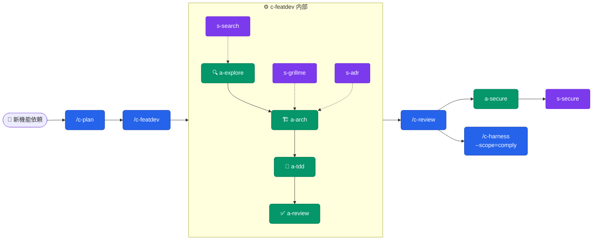

**トリガー**: 新機能実装・機能拡張
**期待効果**: 探索→設計→実装→セキュリティ検証が自動連鎖

---

### WF-2: バグ修正

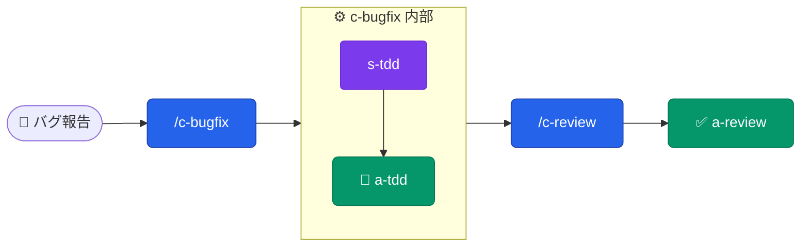

**トリガー**: バグ修正・不具合対応
**期待効果**: 最小修正・回帰防止テスト自動生成

---

### WF-3: フルリファクタリング

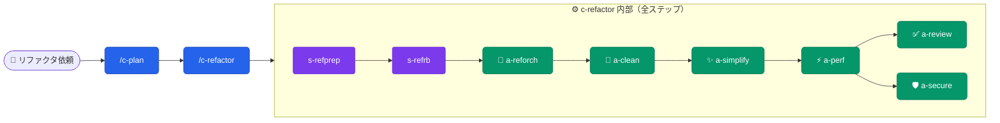

**トリガー**: 5件以上のリファクタ・大規模コード整理
**期待効果**: clean→simplify→perf→review の安全な自動連鎖

---

### WF-4: コード単純化のみ

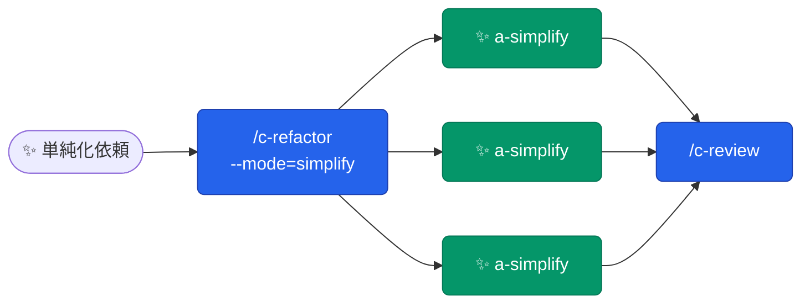

**トリガー**: 可読性・保守性向上のみ、機能変更なし
**期待効果**: 最大4並列でファイルグループを同時単純化

---

### WF-5: デッドコード掃除

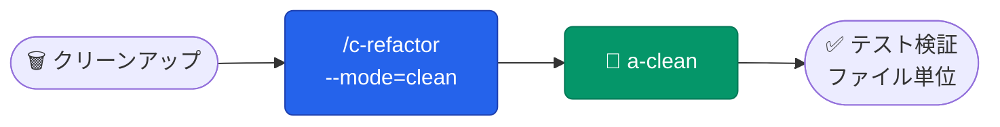

**トリガー**: 未使用コード・依存関係の削除
**期待効果**: 削除ごとにテスト実行、失敗時は即リバート

---

### WF-6: スキル新規作成・改善

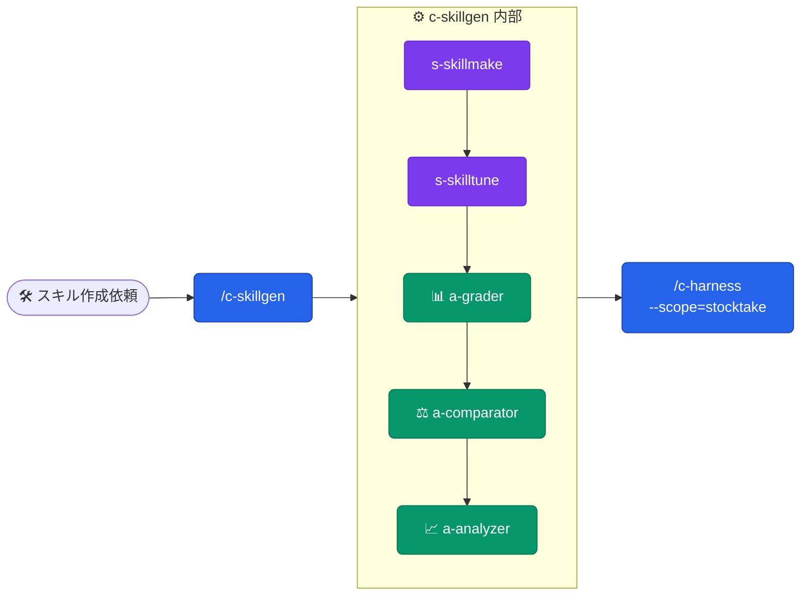

**トリガー**: 新スキル作成・既存スキル改善
**期待効果**: 生成→eval→ベンチマーク分析→品質監査の自動連鎖

---

### WF-7: 品質管理サイクル（定期メンテ）

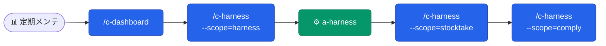

**トリガー**: 週次・月次の品質チェック
**期待効果**: ダッシュボード確認→ハーネス最適化→スキル棚卸し→遵守率の一連確認

---

### WF-8: 学習サイクル（自動バックグラウンド）

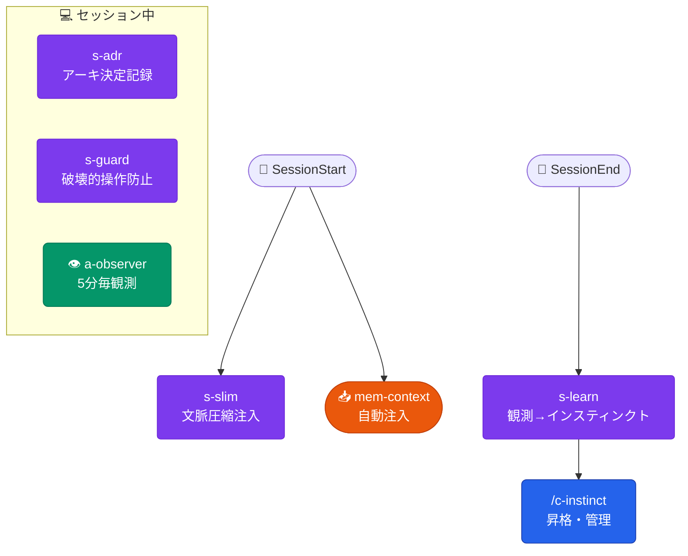

**トリガー**: 自動（ユーザー操作不要）
**期待効果**: セッション知識が自動的にインスティンクトとして蓄積

---

### WF-9: セキュリティ重視の実装

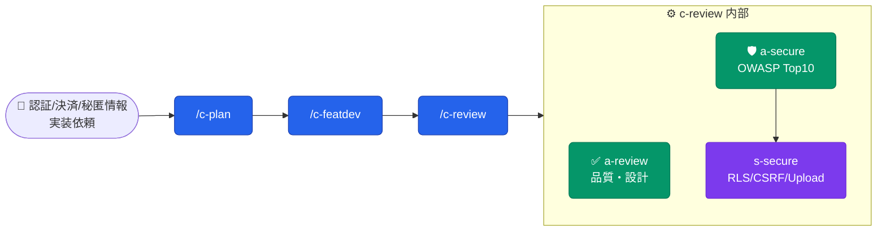

**トリガー**: 認証・決済・シークレット・APIエンドポイント実装
**期待効果**: OWASP検出(a-secure) + 設計チェックリスト(s-secure)の二段構え

---

### WF-10: Gitワークフロー支援（自動アドバイス）

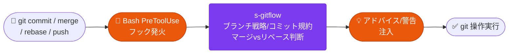

**トリガー**: git commit / merge / rebase / push 実行時（自動）
**期待効果**: ユーザーが普通に git 操作するだけでベストプラクティスのアドバイスが自動注入

---

## 🏗️ Architecture

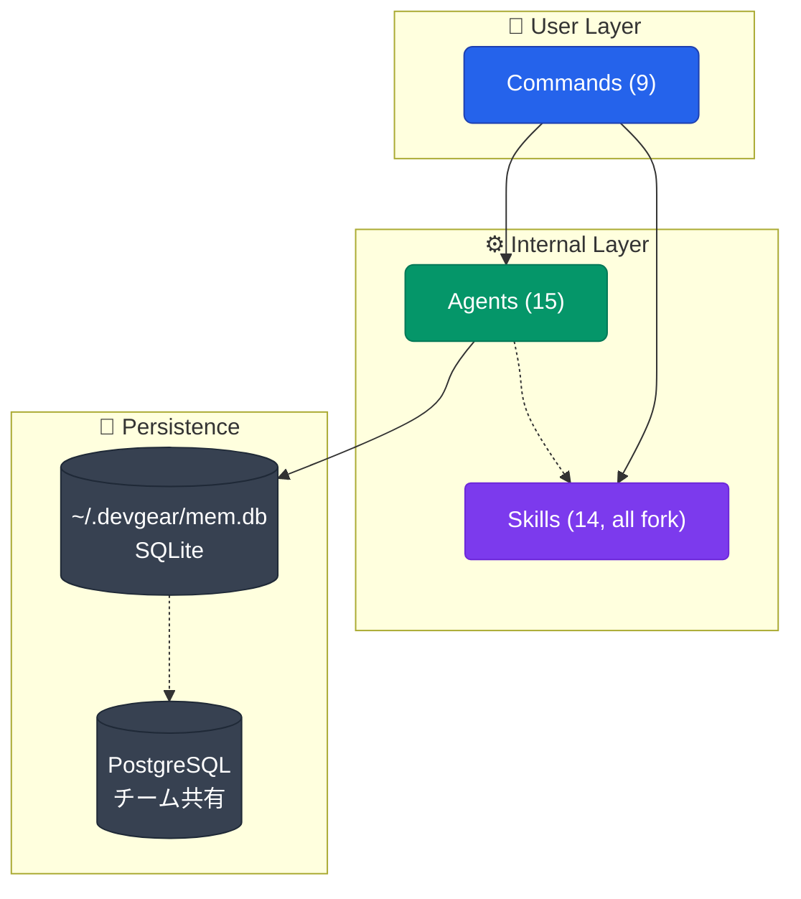

**設計方針**: ユーザーは Commands のみ選択 → 内部で Agents / Skills が自動連鎖。
スキルは全て `context: fork`（内部委譲専用）に統一。
